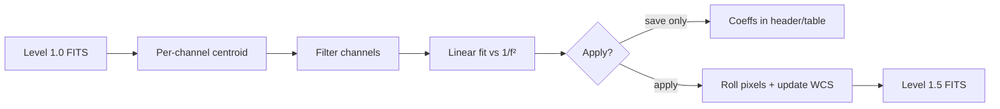

# Refraction correction for OVRO-LWA solar images

This document describes the refraction-correction algorithm implemented in `lwasolarutl.refraction_corr`. The code is ported from the OVRO-LWA solar pipeline ([`ovrolwasolar/refraction_correction.py`](https://github.com/ovro-eovsa/ovro-lwa-solar/blob/b55f56d5/ovrolwasolar/refraction_correction.py), commit `b55f56d5`).

**Worked example:** [`notebook/refraction_correction.ipynb`](notebook/refraction_correction.ipynb)

---

## 1. Purpose

Low-frequency radio images of the Sun are affected by **ionospheric refraction**. The apparent position of solar emission drifts with frequency: dispersive delays make structures shift more at lower frequencies. For multi-frequency cubes (level 1.0 FITS from the OVRO-LWA slow pipeline), channels are misaligned in heliocentric coordinates.

Refraction correction:

1. Estimates the frequency-dependent offset of the **quiet Sun** (or large-scale disk) centroid on each channel.
2. Fits a simple **\(1/f^2\)** model to those offsets.
3. **Shifts** each channel’s image so the fitted solar center is consistent, producing a **level 1.5** product.

The method does not solve full ionospheric tomography; it aligns images using a robust disk-centroid tracker and a two-parameter-per-axis dispersion law.

---

## 2. Input data

| Requirement | Detail |
|-------------|--------|
| Format | Multi-frequency solar FITS readable by `lwasolarutl.ndfits` |
| Data array | Shape `(npol, nchan, ny, nx)`; Stokes I used as `data[0, …]` |
| Units | Brightness temperature **K** (`BUNIT=K`) |
| WCS | `CRVAL1/2`, `CDELT1/2`, `CRPIX1/2`, `NAXIS1/2` in arcsec |
| Frequencies | `meta['ref_cfreqs']` in **Hz**, one value per channel |
| Level | Typically **level 1.0** (`LVLNUM=1.0`, `RFRCOR=False`) |

---

## 3. Overview of the pipeline



Three user-facing stages match the API:

| Stage | Function | Effect on data |
|-------|----------|----------------|
| Fit | `refraction_fit_param` | None |
| Save coeffs | `save_refraction_fit_param` | None (metadata only) |
| Apply | `apply_refra_coeff` | Pixel rolls + WCS update |

For a time series of fits, `apply_refra_record` interpolates coefficients in time before applying.

---

## 4. Per-channel solar centroid

For each frequency channel \(i\) with center frequency \(\nu_i\) (Hz):

### 4.1 Brightness threshold

A channel-dependent threshold (Tb) is computed as:

\[
T_{\mathrm{thresh}}(\nu) = 1.1 \times 10^6 \left(1 - 1.8 \times 10^4 \, \nu^{-0.6}\right) \times f_{\mathrm{bg}}
\]

- Implemented as `thresh_func(ν) * background_factor`.
- Default `background_factor = 1/8` scales the quiet-Sun mask conservatively.

Pixels with \(T_b > T_{\mathrm{thresh}}\) are kept for morphology.

### 4.2 Quiet-Sun mask (`find_quite_sun_region`)

On the binary mask:

1. **Remove small objects** (`remove_small_objects`, connectivity 1).
2. **Erode** 3 iterations (suppresses compact bright features).
3. **Remove small objects** again.
4. **Dilate** 3 iterations (restore approximate disk size).
5. Optionally replace the mask with its **convex hull** (`convex_hull=True`).

The minimum object size (pixels) scales with channel and pixel scale:

\[
N_{\mathrm{min}} = \frac{N_{50}}{(\mathrm{CDELT1}/60'')^2 (\nu / 50\,\mathrm{MHz})^2}
\]

with default \(N_{50} = 1000\) at 50 MHz (`min_size_50`).

### 4.3 Centroid (`find_center_of_thresh`)

- **Center of mass** of the final mask (`scipy.ndimage.center_of_mass`).
- Converted from pixel indices to **arcsec** using the linear WCS grid from the FITS header.
- Returns \((x_i, y_i)\): apparent solar center offset for that channel.

If the mask is empty or ill-defined, the centroid can be **NaN** and that channel is dropped later.

---

## 5. Frequency-dependent shift model

Refraction offsets are modeled as linear in **\(1/\nu^2\)** (ionospheric dispersion in the thin-screen / small-angle regime):

\[
x(\nu) = p_{x0} \,\frac{1}{\nu^2} + p_{x1}, \qquad
y(\nu) = p_{y0} \,\frac{1}{\nu^2} + p_{y1}
\]

- \((p_{x0}, p_{x1})\) and \((p_{y0}, p_{y1})\) are fit with `numpy.polyfit` on the filtered \((1/\nu^2, x)\) and \((1/\nu^2, y)\) samples.
- Fitted shifts for **all** channels (including those not used in the fit) are:

\[
\hat{x}_i = p_{x0}/\nu_i^2 + p_{x1}, \quad
\hat{y}_i = p_{y0}/\nu_i^2 + p_{y1}
\]

---

## 6. Channel selection for the fit (`refraction_fit_param`)

Not every channel is used in the linear fit.

| Filter | Default | Purpose |
|--------|---------|---------|
| `thresh_freq` | 45 MHz | Only \(\nu > \texttt{thresh\_freq}\); low bands often too confused for a stable disk centroid |
| `overbright` | \(2 \times 10^6\) K | Drop channels whose **peak** Tb exceeds this (flare / active region dominance). Set to `None` to disable |
| NaN centroids | — | Removed |
| `min_freqfrac` | 0.3 | Require at least 30% of the above-threshold band count, with absolute minimum **3** channels (**5** if more than 20 channels pass `thresh_freq`) |

If too few channels survive, the fit returns `px = py = [nan, nan]` and emits a **warning** with diagnostic counts.

**Tip:** For bright snapshots where peaks exceed 2 MK, raise `overbright` (e.g. 5% above the max peak above 45 MHz) or pass `return_full_data=True` to inspect `peak_values` per channel. See the example notebook.

---

## 7. Saving coefficients (`save_refraction_fit_param`)

Copies the input FITS and writes **metadata only** (level stays 1.0, data unshifted):

| Location | Content |
|----------|---------|
| Binary table columns | `refra_shift_x`, `refra_shift_y` — \(\hat{x}_i\), \(\hat{y}_i\) per channel |
| Header keywords | `RFRPX0`, `RFRPX1`, `RFRPY0`, `RFRPY1` |
| | `RFRCOR=False`, `RFRVER=1.0`, `LVLNUM=1.0` |
| HISTORY | Timestamp of coefficient calculation |

---

## 8. Applying correction (`apply_refra_coeff`)

Produces a **level 1.5** file:

### 8.1 Per-channel pixel shift

For each polarization and channel:

\[
\Delta x_i = \hat{x}_i - \mathrm{CRVAL1}, \quad
\Delta y_i = \hat{y}_i - \mathrm{CRVAL2}
\]

The image is shifted by integer pixels via `numpy.roll`:

- Axis 0 (y): \(-\mathrm{round}(\Delta y_i / \mathrm{CDELT2})\)
- Axis 1 (x): \(-\mathrm{round}(\Delta x_i / \mathrm{CDELT1})\)

Sub-pixel residuals remain; the pipeline prioritizes speed and simplicity over sinc interpolation.

### 8.2 WCS update

After rolling all channels:

| Keyword | New value |
|---------|-----------|
| `CRVAL1`, `CRVAL2` | `0` (solar origin at disk center) |
| `CRPIX1`, `CRPIX2` | Image center pixel |
| `RFRCOR` | `True` |
| `LVLNUM` | `1.5` |
| `RFRPX0` … `RFRPY1` | Fitted coefficients |

---

## 9. Time interpolation (`apply_refra_record`)

When refraction coefficients are tabulated over many epochs (e.g. pipeline monitoring):

1. Build a `pandas.DataFrame` with columns `Time`, `px0`, `px1`, `py0`, `py1`.
2. Compare observation time of the target FITS to record times.
3. If the nearest record is within `max_dt` seconds (default 600 s), **interpolate** each coefficient with `scipy.interpolate.interp1d` (default `kind='linear'`, extrapolate allowed).
4. Call `apply_refra_coeff` with the interpolated \([p_{x0}, p_{x1}]\), \([p_{y0}, p_{y1}]\).

A single dictionary record with the four keys is applied directly without interpolation.

---

## 10. Python API summary

```python
import lwasolarutl as lsu

# 1. Fit
px, py = lsu.refraction_corr.refraction_fit_param("image_lev1.fits")

# Optional diagnostics
diag = lsu.refraction_corr.refraction_fit_param(
    "image_lev1.fits", return_full_data=True
)

# 2. Save coefficients only
lsu.refraction_corr.save_refraction_fit_param(
    "image_lev1.fits", "image_with_coeff.fits", px, py
)

# 3. Apply → level 1.5
lsu.refraction_corr.apply_refra_coeff(
    "image_lev1.fits", px, py, fname_out="image_lev1.5.fits"
)

# 4. Apply from time series
lsu.refraction_corr.apply_refra_record(
    "image_lev1.fits", refra_record, max_dt=600.0
)
```

### Main parameters

| Parameter | Default | Meaning |
|-----------|---------|---------|
| `thresh_freq` | 45e6 Hz | Lower frequency cutoff for fit samples |
| `overbright` | 2e6 K | Exclude channels with peak Tb above this; `None` = no cut |
| `min_freqfrac` | 0.3 | Minimum fraction of high-frequency channels required |
| `background_factor` | 1/8 | Scales `thresh_func` |
| `convex_hull` | False | Use convex hull of threshold mask |
| `max_dt` | 600 s | Max time offset for record interpolation |

---

## 11. Limitations and assumptions

- **Quiet Sun / disk tracking:** Bright active regions or strong off-limb emission can bias the centroid; `overbright` mitigates flaring channels but bright quiescent disks may need a higher `overbright`.
- **Integer pixel rolls:** Not sub-pixel; fine for OVRO-LWA beam scales but not for high-resolution synthesis.
- **Single \(1/\nu^2\) law:** Does not model temporal variation within the integration unless `apply_refra_record` is used with nearby records.
- **Global shift per channel:** No spatially varying ionospheric structure across the FOV.
- **Stokes I only** for centroid estimation; other polarizations are shifted by the same amount.

---

## 12. Relation to visualization

`slow_pipeline_default_plot` can overlay table columns `refra_shift_x` / `refra_shift_y` when `apply_refraction_param=True` and the file is not already corrected (`RFRCOR` false). After `apply_refra_coeff`, images are already aligned and the header marks `RFRCOR=True`.

---

## 13. References and provenance

- Implementation: [`lwasolarutl/refraction_corr.py`](lwasolarutl/refraction_corr.py)
- Upstream: [ovro-lwa-solar `refraction_correction.py`](https://github.com/ovro-eovsa/ovro-lwa-solar/blob/b55f56d5/ovrolwasolar/refraction_correction.py) (commit `b55f56d5`)
- FITS I/O: [`lwasolarutl/ndfits.py`](lwasolarutl/ndfits.py) (from [lwasolarproc](https://github.com/peijin94/lwasolarproc))
